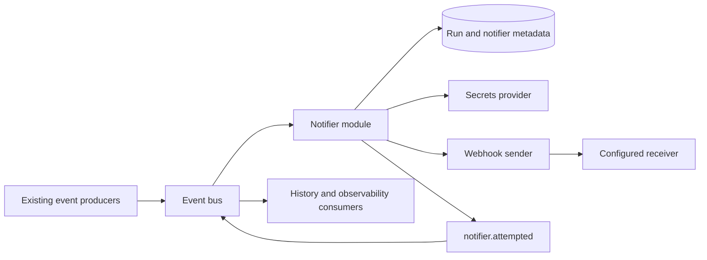

# Pipeline Notifiers: Backend Technical PRD

Status: Proposed implementation specification

Date: 2026-09-09

Scope: Backend configuration, webhook delivery, and notification attempt events

## 1. Product decision

Introduce pipeline-scoped notification rules in a table named **`notifier`** and execute them through a generic **`notifier` module**. Each rule declares a `NotificationType`, the pipeline events it matches, optional resources, and its delivery configuration.

The first release defines and implements `webhook` as the only notification type. Additional channels can be added through the same sender contract when needed; no future notification types are declared in advance.

Every completed sender invocation produces a `notifier.attempted` fact through the existing event publisher, containing the observed delivery outcome. JetStream retains these facts as operational history. There is no notification delivery-state table in this release.

This specification replaces the earlier idea of a webhook JSON column on `pipelines` with normalized notifier rows. It also refines configuration management into pipeline-scoped notifier RPCs, so individual rules can be edited and version-checked without replacing a pipeline's entire list or extending pipeline/schedule creation transactions.

## 2. Goals and boundaries

### Goals

- Configure notifications for any registered pipeline event, including events during execution and at completion.
- Reuse the existing event bus, module host, datastore providers, tenant identity, secret providers, logger, and metrics interfaces.
- Keep notification configuration independent of pipeline graph versions and checkpoint identities.
- Make the module generic while keeping webhook delivery small and explicit.
- Automatically protect credentials and secret-bearing destination URLs.
- Expose correlated delivery attempts in JetStream for inspection and future projections.
- Operate in the distributed control plane and the existing application compositions.

### Outside the first release

- Frontend screens, CLI commands, and declarative CLI document syntax for notifiers.
- Email, Slack, or any other additional sender.
- Custom payload templates, arbitrary request methods, expressions over payload fields, and user-supplied executable code.
- OAuth token acquisition, webhook signature schemes, and automatic parsing of third-party webhook response bodies.
- An aggregate "all routes of this pipeline invocation completed" event.
- A delivery ledger, outbox, dead-letter queue, retry scheduler, manual replay API, or historical counts API.
- Exactly-once delivery, strict delivery ordering, or exact accounting of remote side effects.
- Automatic changes to NATS retention or existing secret provider selection.

## 3. Existing architecture and constraints

These findings are based on the current repository, not assumptions about a generic NATS application.

| Existing code | Consequence for this feature |
| --- | --- |
| [`events/catalog.go`](../../events/catalog.go), [`events/registry.go`](../../events/registry.go) | There are 25 registered ingestion event types. Use the registry for validation and future event support. |
| [`events/subject.go`](../../events/subject.go) | Subjects are `ingestion.v1.<entity>.<tenant>.<run>.<event>`. Resource identity is in the envelope. |
| [`events/emit.go`](../../events/emit.go), [`events/wire.go`](../../events/wire.go) | `events.Emit` publishes registered typed facts; the codec rejects unknown event types. |
| [`runner/emitter.go`](../../runner/emitter.go) | The private runner emitter also manages execution counters. The notifier module uses shared `events.Emit` directly. |
| [`eventbus/host/host.go`](../../eventbus/host/host.go) | One pump handles each subscription. Returning nil acknowledges; returning an error negatively acknowledges. |
| [`eventbus/nats/nats.go`](../../eventbus/nats/nats.go) | Durable consumers, a 30-second default acknowledgement window, one-second delayed negative acknowledgements, and a default seven-day stream retention already exist. The generic message interface exposes no delivery-attempt count. |
| [`internal/runs/runs.go`](../../internal/runs/runs.go) | Run requests are persisted before publishing `run.requested`; the saved request contains the pipeline identity. |
| [`internal/compile/compile.go`](../../internal/compile/compile.go) | A pipeline compiles into one run per source-to-destination route. `run.completed` is route completion. |
| [`internal/modules/scheduler/scheduler.go`](../../internal/modules/scheduler/scheduler.go) | `schedule.fired` references the first submitted run of the occurrence. It is not emitted once per route. |
| [`infra.go`](../../infra.go), [`server/connections.go`](../../server/connections.go) | Secrets already have read/write/delete operations and tenant-scoped reference validation. Connection APIs demonstrate write-before-persist and cleanup-on-failure. |
| [`eventbus/inproc/inproc.go`](../../eventbus/inproc/inproc.go) | Local fanout blocks on full subscriber buffers. It is memory-only and has different retry semantics from NATS. |

The event envelope carries tenant and run identity, but no pipeline ID. The module must load the run's saved request to find its pipeline. It must not infer ownership from configurable subjects or use an unscoped pipeline lookup.

The state tracker consumes events independently. A notification can arrive before the tracker has updated the run's visible status or checkpoints. The webhook's event is authoritative about what was emitted; it does not promise that a subsequent API read already reflects the event.

Current eligible event catalog:

| Family | Exact event names |
| --- | --- |
| Run | `run.requested`, `run.started`, `run.completed`, `run.failed`, `run.partial`, `run.canceled`, `run.paused`, `run.pause_requested`, `run.cancel_requested`, `run.heartbeat` |
| Resource | `resource.started`, `resource.page_fetched`, `resource.fan_out_started`, `resource.completed`, `resource.failed` |
| Batch | `batch.buffered`, `batch.written`, `batch.integrity_verified`, `batch.encoded_integrity_verified`, `batch.chunk_divergence` |
| Cursor | `cursor.watermark_advanced`, `cursor.checkpoint_saved` |
| Pressure | `pressure.rate_limited`, `pressure.retry_exhausted` |
| Schedule | `schedule.fired` |

The module observes control-request events like any other eligible fact; it does not execute the control request. Future registered events are eligible automatically unless they use the reserved notification lifecycle entity.

## 4. User-visible behavior

1. A caller creates a notifier for an existing, non-deleted pipeline.
2. The caller selects event names, optionally restricts resource names, and supplies webhook destination credentials or an existing destination secret reference.
3. The API validates and stores the rule. Responses never return inline destination credentials.
4. When a matching event reaches the module, it sends the standard notification payload.
5. The module publishes an attempt result with notifier, trigger, delivery, and attempt identities.
6. Disabling or deleting a notifier stops it from being selected on subsequent processing passes.

Configuration is evaluated when the source event is processed, including redelivery. There is no per-run configuration snapshot. A change can therefore affect an older queued event. Deletion or disablement does not recall a request already in flight. The module loads the current notifier version on each processing pass and does not cache configuration across messages in v1.

A newly added notifier can match an event already pending on the module's durable consumer. The consumer does not replay old acknowledged events when a notifier is created. These are processing-time subscriptions, not timestamp-based subscriptions.

## 5. Persistence model

Create additive migrations in both Postgres and SQLite. Use the singular table name **`notifier`**, as requested. Do not modify already-applied initial migrations.

| Column | Postgres representation | Meaning |
| --- | --- | --- |
| `id` | UUID primary key | Server-generated stable notifier identity. |
| `tenant_id` | UUID, not null | Tenant ownership. |
| `pipeline_id` | UUID, not null | Owning pipeline. |
| `name` | Text, not null | Human-readable label; uniqueness is not required. |
| `notification_type` | `notification_type` enum, not null | The only enum value is `webhook`. |
| `enabled` | Boolean, not null, default false | Explicit opt-in to sending. |
| `events` | JSONB, not null | Non-empty array of exact registered event names, or `["*"]`. |
| `resources` | JSONB, not null, default `[]` | Empty means unrestricted; otherwise exact resource names. |
| `config` | JSONB, not null, default `{}` | Non-secret settings specific to the sender. Empty for webhook v1. |
| `secret_refs` | JSONB, not null, default `{}` | For webhook v1: `{ "destination": "opaque-reference" }`. |
| `version` | Bigint, not null, default 1 | Optimistic concurrency revision, incremented on update and deletion. |
| `is_deleted`, `deleted_at` | Boolean and nullable timestamp | Soft deletion, following existing records. |
| `created_at`, `updated_at` | Timestamps | Server-owned timestamps. |
| `created_by_user_id`, `updated_by_user_id`, `deleted_by_user_id` | Nullable UUIDs | Follow the existing audit conventions. |

Create the Postgres enum with `CREATE TYPE notification_type AS ENUM ('webhook')`. SQLite represents the same closed set as `TEXT NOT NULL CHECK (notification_type IN ('webhook'))`, because it has no native enum type. SQLite otherwise uses the repository's existing text-ID, integer-boolean, timestamp, and JSON-text conventions for the equivalent model.

Constraints and access:

- Add a composite foreign key `(pipeline_id, tenant_id)` to `pipelines(id, tenant_id)`.
- Index active notifier rows by `(tenant_id, pipeline_id)`; list deterministically by ID.
- Every operation scopes by tenant and pipeline. Update/delete also require the expected notifier version.
- Enforce a maximum of eight active, non-deleted notifier rows per pipeline. Disabled rows count toward this limit. This bounds both configuration and per-event fanout.
- Enforce the count under a parent pipeline lock/transaction so concurrent creates cannot exceed the limit.
- Pipeline deletion soft-deletes its notifiers in the same datastore transaction that deletes its schedule and pending runs. Parent soft deletion alone must also suppress delivery.
- Retain deleted row metadata for operational correlation; never resolve a deleted row for delivery.

Add a domain `Notifier` and a separate optional `NotifierStore` capability alongside the other infrastructure interfaces. Methods cover create, load, list, versioned update, and versioned soft delete. Both shipped datastores implement it. Keep notification persistence out of the base `DataStore` interface so unrelated custom adapters remain source-compatible.

Create/update/delete must recheck parent liveness in their transaction, not just in the API's earlier read. Map version conflicts to the existing `ErrVersionConflict` convention.

## 6. API contract

Add `protos/ingestion/v1/notifiers.proto`, import it in `service.proto`, and add four RPCs to the existing `IngestionService`:

| RPC | Required input | Result |
| --- | --- | --- |
| `CreatePipelineNotifier` | Pipeline ID and notifier input | Created notifier, version 1. |
| `UpdatePipelineNotifier` | Pipeline ID, notifier ID, expected version, notifier input | Updated notifier with incremented version. |
| `ListPipelineNotifiers` | Pipeline ID | All active rows, including disabled rows; maximum eight. |
| `DeletePipelineNotifier` | Pipeline ID, notifier ID, expected version | Empty response after soft deletion. |

No pagination is needed for this bounded collection. No standalone get RPC is needed in v1. Existing pipeline create/update requests remain unchanged; callers create the pipeline first, then configure its notifiers. The frontend can later load the list on the pipeline settings page without changing this contract.

### Types

Use an enum consistently across the protobuf API, Go domain model, and persistence boundary:

```proto
enum NotificationType {
  NOTIFICATION_TYPE_UNSPECIFIED = 0;
  NOTIFICATION_TYPE_WEBHOOK = 1;
}
```

Go uses a typed integer enum with the corresponding named constants shown in the sender contract below. Convert explicitly between protobuf values, domain constants, and the database enum label `webhook`; never cast unchecked integers or persist protobuf ordinals. `UNSPECIFIED` is an input sentinel and has no database label. Reject unknown values at API and persistence boundaries rather than defaulting to webhook.

Attempt-event JSON and metric labels use the enum's explicit lowercase wire label `webhook`. The attempt payload's Go field is typed as `NotificationType`; provide strict JSON marshal/unmarshal conversion rather than allowing arbitrary strings or default integer encoding. Keep published protobuf numbers stable; never renumber or reuse them.

Define separate input and response messages. Input contains:

- `name`, `notification_type`, `enabled`, `events`, and `resources`.
- A sender-config `oneof`, initially containing `WebhookNotifierInput`.
- `WebhookNotifierInput` has a destination `oneof`: an inline `WebhookDestination { url, headers }` or a `destination_secret_ref`.

The response contains identity, name, type, enabled flag, filters, non-secret config, opaque secret references, version, and audit timestamps. It has no inline destination field. Opaque references remain subject to the same tenant authorization as notifier configuration.

Example create request, using protobuf JSON field names:

```json
{
  "pipelineId": "<pipeline-uuid>",
  "notifier": {
    "name": "Notify downstream service",
    "notificationType": "NOTIFICATION_TYPE_WEBHOOK",
    "enabled": true,
    "events": ["run.completed", "run.failed"],
    "resources": [],
    "webhook": {
      "destination": {
        "url": "https://example.com/hooks/filament",
        "headers": { "Authorization": "Bearer supplied-token" }
      }
    }
  }
}
```

### Validation and update semantics

- Create requires a supported type, at least one event selection, and a destination. `UNSPECIFIED` and unknown types are rejected as `InvalidArgument` in v1.
- `notification_type` is immutable after creation. Changing channels means creating a new notifier.
- Update replaces name, enabled state, and filters. It is not a field-mask patch.
- On update, omitted destination input retains the stored destination reference. A supplied destination replaces the whole URL/headers object; it does not merge headers.
- An empty supplied destination is invalid. Headers may be empty for unauthenticated webhooks.
- Canonicalize/deduplicate event and resource lists. Event matching is case-sensitive.
- Accept exact names from `events.Names()` or the single entry `*`. Reject combinations of `*` with exact names, raw NATS subjects, and partial wildcard expressions.
- Reject explicit notification lifecycle event names. `*` means all eligible ingestion events, excluding notification lifecycle events.
- Resource filters use exact envelope resource strings. A non-empty filter cannot match a run-level event with an empty resource. Do not validate resource existence through source discovery: event resources may be dynamic.
- Enforce reasonable bounds: name 200 characters, eight notifiers per pipeline, 256 resource filters per notifier, destination JSON 32 KiB, URL 8 KiB, and at most 32 configured headers.
- A missing or cross-tenant pipeline/notifier returns `NotFound`; a deleted pipeline returns `FailedPrecondition`; a stale version returns `Aborted`.
- Inline destination input with no writable secret provider returns a sanitized `FailedPrecondition`. Datastore failures return sanitized `Internal` errors.

Expose these RPCs through the existing authentication interceptor. Add mutation procedures to the logging classifier. Regenerate Go protobuf/Connect stubs and the checked-in TypeScript protocol definitions; UI behavior remains unchanged.

## 7. Secret handling

The webhook destination is a single JSON secret:

```json
{
  "url": "https://example.com/hooks/possibly-secret-token",
  "headers": { "Authorization": "Bearer supplied-token" }
}
```

Encrypting the entire object protects tokens in URLs as well as header credentials. The `notifier` table stores only its reference. The sender resolves the object immediately before delivery; resolved values never enter the run request, worker spec, notification payload, or attempt event.

Managed references use:

```text
filament/<tenant-id>/notifier/<notifier-id>/destination/<random-revision-uuid>
```

Use a random revision rather than only a numeric version so two racing updates never write to the same secret reference. The existing tenant validator recognizes the `filament/<tenant>/...` ownership prefix; add notifier-specific reference construction/ownership helpers without changing existing connection reference behavior.

Mutation sequence:

1. Authenticate, load the parent and current notifier if applicable, validate ownership/version, and validate input.
2. For inline credentials, write a new secret through `filament.Secrets` with the authenticated tenant.
3. Persist the notifier mutation with a version check and parent-liveness check.
4. On database failure, delete only the secret written by this request.
5. On success, best-effort delete the replaced reference only if it belongs to this notifier's managed namespace.

Never delete caller-managed external references. A caller-supplied managed reference must belong to this notifier, not merely another object in the same tenant. External references follow the existing deployment-controlled secret provider conventions. Read and validate a supplied reference before accepting configuration; do not send an HTTP test request during configuration.

Deletion performs database soft deletion before best-effort managed-secret cleanup. Pipeline deletion enumerates its managed notifier references, performs the transactional deletion, then attempts cleanup. A cleanup failure is logged without secret material and does not roll back committed metadata. A process crash between secret write and metadata persistence can leave an orphan; automatic orphan collection is deferred.

Environment secrets are read-only. Those deployments can configure `destination_secret_ref` pointing to a JSON value provided through the environment. Inline input fails explicitly. Postgres and encrypted SQLite providers retain their existing behavior. Do not silently fall back to plaintext storage or change the standalone binary's provider.

A concurrent configuration replacement may remove a secret an in-flight handler just selected. On a missing managed reference, reload the notifier once. If its version changed, use the new current configuration; if it was deleted/disabled, skip it. Otherwise classify the resolution failure as retryable configuration failure. Requests that already resolved the old value may finish with it.

## 8. Generic module and sender contract

The module remains an ordinary `module.Module`. It takes the bus, datastore, secrets, logger, and metrics from `module.Deps`, and obtains `NotifierStore` through the optional datastore capability.

Conceptual domain contract:

```go
type NotificationType int

const (
    NotificationUnspecified NotificationType = 0
    NotificationWebhook     NotificationType = 1
)

type Sender interface {
    Send(ctx context.Context, notification Notification) (DeliveryResult, error)
}
```

`Notification` contains notifier identity/version/type, pipeline identity/version, delivery and attempt IDs, trigger subject and stream sequence, the decoded trigger fact, and the resolved sender configuration. It is in-memory only. `DeliveryResult` contains outcome, retry classification, optional HTTP status, duration, a sanitized error code, and whether an external request was attempted. The error return represents an unexpected internal sender failure; ordinary remote rejection is a result. The module normalizes either path into one attempt fact.

Do not make the root domain package import `events`: `events` already imports the root package. Put `Notification`, `DeliveryResult`, and `Sender` in a small `internal/notification` package; keep persistence-only types and `NotificationType` in the root package. The module and webhook sender depend on that contract package, avoiding import cycles.

Use constructor-injected registration, initially:

```go
map[filament.NotificationType]notification.Sender{
    filament.NotificationWebhook: webhookSender,
}
```

There is no global plugin registry or dynamic loader. The module owns matching, secret resolution, identities, concurrency, acknowledgements, and attempt reporting. The sender owns channel-specific request construction and result classification. Sender-specific validation lives alongside its implementation and is reused at the API boundary.

## 9. Processing and subscription behavior



Declare one subscription:

```text
Pattern:     ingestion.v1.>
Durable:     notifier
Replay:      false
MaxInFlight: 1
```

The stable durable name is shared by control-plane replicas; do not suffix it with a process or pod ID. `Replay: false` creates a new consumer at the live tail, while an existing durable resumes its pending work. This setting does not discard pending deliveries on restart.

Processing algorithm:

1. Decode the fact. Ignore malformed/foreign payloads with sanitized diagnostics. Reject all `notifier.*` lifecycle facts before datastore access.
2. Require valid tenant/run identity and a non-zero broker sequence for a deliverable trigger. Missing sequence cannot support stable delivery identity; report an internal error and negatively acknowledge.
3. Load the run using `(tenant, run)`. Missing runs and runs without a pipeline are skipped; transient datastore errors retry.
4. Load the tenant-scoped parent pipeline. Skip missing/deleted pipelines.
5. List its current active notifier rows and select enabled rows matching both event and resource filters.
6. Resolve configuration and invoke selected senders with bounded concurrency. All selected rows are considered; one failure must not prevent the others from being attempted.
7. Publish one attempt result for each completed sender invocation, and configuration-failure results for selected notifiers that could not reach the sender.
8. Return an error if any selected notifier has a retryable delivery/configuration failure. Otherwise return nil. The host performs the acknowledgement.

Keep the entire processing pass bounded at 25 seconds, below the NATS default acknowledgement window. Allocate up to 18 seconds for lookup, secret resolution, and sender work, with the remaining budget for result publication. Each HTTP request has a five-second timeout. Run at most eight notifier operations concurrently; the API/database limit bounds the work for one trigger. Await all started operations and cancel unfinished work at the phase deadline. Do not launch detached per-delivery goroutines.

Publish results as they become available within the overall budget. Result publication failure produces sanitized logs and a counter; it does not turn an otherwise accepted delivery into a retryable delivery. This avoids intentionally repeating a remote side effect solely because reporting failed. There is no durable reporting queue in v1.

If cancellation prevents a selected operation from starting, the source message is retryable. If a sender started and timed out, record its observed outcome when possible. On process shutdown, use bounded cleanup contexts for reporting already-observed outcomes; do not begin new deliveries.

### Feedback prevention

All notification lifecycle events use the reserved `notifier` entity. The module ignores that entity independently of saved rule validation, protecting against malformed rows and wildcard rules. Tracking facts remain visible to other consumers and `TailRun`.

### Embedded transport integration

The same module is mounted for embedded applications, but the in-process bus remains memory-only and can backpressure ingestion. NATS is the supported durable delivery path.

There is a specific cancellation gap to address during implementation: `inproc.Publish` checks context before fanout, but its blocking subscription delivery does not currently observe that context. A module publishing its own result while its input buffer is full can therefore exceed the reporting deadline. Add a narrowly scoped cancellation-aware path for publish fanout, preserving existing close and redelivery behavior. A cancelled publication may have reached some subscribers; it must return a context error instead of hanging. Test this condition explicitly. This is required for bounded shutdown, not a redesign of the in-process bus.

## 10. Webhook sender

### Request

- Method: `POST`.
- Content type: `application/json`.
- Body: a versioned notification envelope containing the existing event JSON frame.
- Authentication: configured headers, including complete `Authorization` or API-key values.
- Use an injected, reusable `http.Client` and connection pool. Do not create a client per request.

Example body:

```json
{
  "schema_version": "1",
  "notifier_id": "<notifier-uuid>",
  "notifier_version": 1,
  "delivery_id": "<stable-digest>",
  "pipeline_id": "<pipeline-uuid>",
  "pipeline_version_id": "<pipeline-version-uuid>",
  "trigger_stream_sequence": "4821",
  "event": {
    "type": "run.completed",
    "tenant": "<tenant-uuid>",
    "run": "<run-uuid>",
    "seq": 42,
    "at": "2026-09-09T14:00:00Z",
    "data": { "records": 1500, "bytes": 42000 }
  }
}
```

Embed the event frame from `events.Marshal`; do not separately maintain serializers for each catalog event. The nested event retains its existing wire types. New `uint64` correlation fields use decimal strings to avoid loss of precision in JavaScript clients. Do not serialize the entire run request, source/sink configurations, or resolved secrets.

Headers set by Filament:

```text
Content-Type: application/json
Filament-Delivery-Id: <stable-delivery-id>
Filament-Attempt-Id: <unique-attempt-uuid>
Filament-Event-Type: run.completed
```

Destination header configuration cannot override these, `Host`, `Content-Length`, or hop-by-hop headers. Validate names and reject CR/LF values. Close every response body; consume at most 4 KiB for connection reuse, and never include its contents in logs or attempt events.

### URL and transport rules

- Require an absolute HTTP(S) URL; HTTPS is the production default. Plain HTTP is allowed only through an explicit deployment-level option for development/internal endpoints.
- Reject URL userinfo and fragments. Query/path tokens are supported because the destination is secret-backed.
- Disable redirects so credentials cannot be forwarded to a second destination.
- Validate resolved addresses at dial time, including IPv4/IPv6 representations, to prevent DNS rebinding. Public destinations are allowed by default; loopback, private, link-local, unspecified, and multicast addresses are blocked unless an operator supplies a narrow destination allowlist.
- Apply the same address policy to all resolved addresses and retries. Dial an approved resolved address while preserving the original TLS server name.
- Use a dedicated transport without ambient environment proxies, so proxy routing cannot bypass the address policy. Explicit proxy support is deferred.
- Keep TLS certificate verification enabled. Tests inject a trusted local transport/allowlist rather than weakening production defaults.

### Result classification

| Observation | Outcome | Retry source message? |
| --- | --- | --- |
| HTTP 2xx | `accepted` | No, unless another notifier needs retry. |
| HTTP 408, 425, 429, or 5xx | `failed` | Yes. |
| Other non-2xx response, including disabled redirects | `failed` | No. |
| Timeout or transport failure where remote receipt is uncertain | `unknown` | Yes. |
| Known pre-send transient failure, such as temporary DNS failure | `failed` | Yes. |
| Destination violates configured transport policy | `failed` | No; operator must edit policy/configuration. |
| Configuration/secret resolution failure | `failed`, `request_attempted=false` | Yes, allowing secret restoration/rotation to repair it. |

`accepted` means the receiver returned 2xx, not that its downstream processing finished. Use a bounded error-code vocabulary such as `timeout`, `transport_error`, `http_rejected`, `rate_limited`, `destination_blocked`, `secret_unavailable`, and `invalid_configuration`. Never publish raw `url.Error` strings or response bodies.

V1 uses the bus's existing retry timing. It does not promise to honor `Retry-After`, apply exponential backoff, or stop after a configurable number of attempts. These require delivery-specific retry state and remain explicit limitations.

## 11. Attempt event and correlation

Register one new catalog payload and event type:

```text
Event name: notifier.attempted
Subject:    ingestion.v1.notifier.<tenant>.<run>.attempted
```

Publish with `events.Emit` from the notifier module. Use the trigger's tenant, run, and resource, and the attempt completion timestamp. The envelope's producer `Seq` is not a cross-producer identity; it may be zero, as with existing non-runner producers. Do not change the runner's private emitter or execution counters.

Attempt data fields:

| Field | Meaning |
| --- | --- |
| `notifier_id`, `notifier_version` | Configuration selected for this operation. |
| `notification_type` | `webhook` in v1. |
| `pipeline_id`, `pipeline_version_id` | Identity from the saved run request. |
| `delivery_id` | Stable identity for a notifier and triggering broker message. |
| `attempt_id` | New UUID for each selected delivery operation. Reuse if publishing the same result is retried. |
| `trigger_type`, `trigger_subject` | Original event identity and concrete subject. |
| `trigger_stream_sequence` | Original broker sequence, serialized as a decimal string. |
| `outcome` | `accepted`, `failed`, or `unknown`. |
| `request_attempted` | Whether the webhook sender invoked the outbound HTTP request. False for configuration failures. It is not proof that bytes reached the receiver. |
| `retryable` | Whether this result requires source-message redelivery. |
| `status_code` | HTTP status when observed; omit otherwise. |
| `duration_ms` | Time spent on this notifier operation, including secret resolution. |
| `error_code` | Sanitized classification, omitted for acceptance. |

Derive `delivery_id` as a SHA-256 digest of an unambiguous, versioned encoding of notifier ID, trigger subject, and original broker sequence. A notifier is scoped to one event-plane lifetime. Source stream restoration/recreation that reuses sequences is outside this identity guarantee; a future stream-generation identity would be required to span it. Do not use only the event envelope's `Seq` and do not use `DedupSeen`, which is the tracker's shared run high-water mark.

The same notifier/trigger retains its delivery ID even if configuration changes before retry. Attempt facts capture the selected configuration revision. Changing the receiver is therefore not a supported mechanism for forcing a new logical delivery of an acknowledged event.

### Counting from JetStream

- Observed operations: distinct `attempt_id` values.
- Observed outbound request attempts: distinct `attempt_id` where `request_attempted=true`.
- Accepted operations: distinct `attempt_id` where `outcome=accepted`.
- Logical deliveries observed: distinct `delivery_id` values.
- Group by notifier, notification type, pipeline, or outcome from the payload.

The subject permits tenant/run filtering, but not direct per-notifier subject filtering. A reader must decode payloads to aggregate by notifier. This release supplies the events and documents the counting semantics; it does not add an aggregation service or UI.

Consumer redelivery counters are not HTTP attempt counters: one source message may match several notifiers and may fail before any request is sent.

## 12. Reliability and failure semantics

This design provides retrying delivery from a retained NATS source message, with duplicates possible. Attempt history is best-effort operational evidence. Neither is an exactly-once contract.

| Failure window | Expected behavior |
| --- | --- |
| Process exits before HTTP starts | Unacknowledged source event can be redelivered. No recorded attempt may exist. |
| Receiver accepts; process exits before reporting | Receiver may have acted; the attempt fact may be absent; redelivery may send again. |
| Attempt event is published; source acknowledgement is lost | Source can be redelivered and another attempt can occur. |
| Reporting publication fails after HTTP succeeds | Log/count reporting failure. Do not intentionally resend solely for reporting. |
| One destination succeeds and another needs retry | Redeliver the source event; successful destinations can be invoked again. |
| Notifier is disabled/deleted before retry | It is skipped on the new processing pass. |
| NATS retention expires | Source retry work and retained attempt history may disappear according to stream policy. |
| In-process application restarts | In-memory bus backlog and attempt history are lost. |

The current NATS adapter has a one-second negative-ack delay and no exposed attempt limit. With default retention, retry work is bounded by the original source event's seven-day lifetime. A deployment that disables age expiration can retry indefinitely. Attempt events have their own publication times and retention windows.

One durable consumer with `MaxInFlight=1` is deliberately modest. Bounded parallel fanout prevents serial HTTP latency from multiplying by the notifier count, but slow/broken destinations still reduce global notification throughput. High-frequency events such as heartbeat, page, or batch events produce a notification per occurrence with no batching or sampling. This release is intended for modest notification volume; production documentation must state this limit.

The implementation must never change a pipeline's status because a notifier failed. NATS isolates notification processing from extraction. The in-process transport's existing backpressure means that equivalent latency isolation is not guaranteed locally.

## 13. Observability and deployment

Use `module.Deps.Log` and `Metrics` where present. Do not require a new metrics backend.

Add counters for notifier operations by type/outcome, outbound requests by outcome, configuration failures, and attempt-report publication failures, plus an operation-duration histogram. Metric labels must be bounded (`notification_type`, `outcome`, and error class); put notifier/run/pipeline IDs in structured logs and attempt events rather than metric labels.

Use metric names `filament_notifier_operations_total`, `filament_notifier_requests_total`, `filament_notifier_configuration_failures_total`, `filament_notifier_report_failures_total`, and `filament_notifier_operation_duration_seconds`.

Expose deployment configuration through a small module/transport options struct and equivalent environment settings in the executable composition:

| Setting | Default | Behavior |
| --- | --- | --- |
| `NOTIFIER_ENABLED` | `true` | Mount consumption when the datastore supports it. Set false during staged rollout. RPCs remain available. |
| `NOTIFIER_ALLOW_HTTP` | `false` | Permit HTTP URLs in addition to HTTPS. This does not bypass address validation. |
| `NOTIFIER_ALLOWED_CIDRS` | Empty | Comma-separated, operator-approved destination networks that may include otherwise blocked private/loopback/link-local unicast addresses. |

Reject malformed settings at startup. Unspecified and multicast destination addresses are always rejected. Apply the same transport policy in API validation and delivery processes. Programmatic application users set the equivalent options directly. Timeouts, maximum notifier count, and fanout limits remain fixed backend defaults in v1 rather than exposing per-rule tuning.

Mount the module in:

- `cmd/control-plane/main.go` for distributed operation.
- `app/app.go` for the shared embedded/application composition, including standalone NATS and the local CLI application.

Do not mount a second delivery module in the API-only server or worker binary. API-only processes still implement notifier RPCs and use the configured secret provider.

When a custom datastore lacks `NotifierStore`, omit the module and return `Unimplemented` from notifier RPCs. Emit a startup diagnostic; do not break existing applications that do not use the feature. Shipped stores provide the capability.

Rollout order:

1. Apply additive notifier migrations in Postgres/SQLite.
2. Deploy the new catalog definition and codec support to all processes that consume ingestion events. Older codecs terminate unknown event types, so publishing first can lose visibility for older consumers.
3. Enable/mount notifier consumption and expose the RPCs. There are initially no configured rows and therefore no external delivery.
4. Create a test notifier and verify an attempt fact and receiver request using a controlled pipeline run.

Provide a deployment startup switch for suppressing notifier consumption during staged rollout; it does not delete the durable consumer. Keep any existing pending messages on rollback. API/configuration rollback must not delete notifier data or secrets automatically.

## 14. Implementation work breakdown

| Work | Files/areas | Completion criterion |
| --- | --- | --- |
| Domain model | New root `notifier.go`; `infra.go` if needed | Types and optional store capability; no domain/event import cycle. |
| Schema and persistence | New Postgres/SQLite migrations, queries, `notifiers.go`, pipeline deletion paths, generated sqlc | Tenant isolation, version checks, parent-liveness checks, limits, and equivalent provider behavior. |
| API | New `notifiers.proto`, `service.proto`, `server/notifiers.go`, server wiring/logging, generated clients | Four working pipeline-scoped RPCs; write-only destination input. |
| Secrets | Notifier reference helpers and API handling | Managed writes, reference validation, rollback, rotation, and safe cleanup. |
| Sender contract | `internal/notification` | Generic request/result types and sender interface. |
| Webhook delivery | `internal/notification/webhook` | Fixed payload/headers, secure destination handling, bounded HTTP behavior. |
| Module | `internal/modules/notifier` | Matching, bounded fanout, acknowledgement policy, and attempt reporting. |
| Catalog | `events/catalog.go` and codec/catalog tests | `notifier.attempted` round-trips through the existing codec. |
| Local transport | `eventbus/inproc` | Context-aware blocking publish fanout and shutdown regression tests. |
| Composition | `app/app.go`, `cmd/control-plane/main.go`, relevant options/configuration | One notifier consumer group; existing custom providers still work. |
| Documentation | Service API and deployment/configuration docs | Configuration examples, counting semantics, secrets and retry limitations. |

Keep PRs reviewable by sequencing domain/persistence, API/secrets, sender/module/events, then wiring/integration. Every stage must build; do not enable dispatch before catalog-compatible consumers are deployed.

## 15. Validation and acceptance criteria

### Persistence and API

- Postgres and SQLite pass equivalent create/list/update/delete tests, including a stale version and a concurrent create at the eight-row limit.
- Cross-tenant and cross-pipeline IDs cannot load, modify, delete, or execute a notifier.
- A concurrent parent deletion cannot leave a newly active notifier.
- Pipeline soft deletion suppresses delivery and soft-deletes owned rules without affecting retained run history.
- Updating a notifier creates no graph version and changes no checkpoint route or replication-stream identity.
- Unsupported notification types, malformed event selectors, and mismatched sender configuration are rejected.
- Enum conversions round-trip between protobuf, Go, database labels, and attempt-event JSON. Unknown values and persisted `UNSPECIFIED` are rejected; SQLite's check constraint and the Postgres enum enforce the same allowed labels.
- Omitted destination on update preserves credentials; replacement does not merge old headers.
- Writable providers store no inline destination in notifier columns or responses. Read-only providers support explicit JSON secret references and reject inline writes.
- Failed persistence cleans up only newly written secrets; racing updates use distinct references; external references are never deleted.
- Raw URLs, headers, credentials, and response bodies do not appear in error responses, structured logs, or attempt facts, including validation failures.

### Matching and module behavior

- Iterate the actual event registry in a parameterized test; every eligible event can match an exact rule and `*` without adding sender cases.
- Cover run, resource, batch, cursor, pressure, and schedule families; verify the scheduler's first-run association.
- Resource-filtered rules match only exact non-empty resource names.
- `notifier.attempted` never invokes a sender, including when rows are injected directly with wildcard or lifecycle selectors.
- Missing run/pipeline, deleted/disabled notifiers, and runs without a pipeline produce no HTTP request.
- One failing notifier does not prevent other selected notifiers from being attempted.
- Secret-resolution failure has `request_attempted=false`; sender invocations generate appropriately classified results.
- Fresh processing after an update uses the new notifier version; an already-started request may finish with its selected version.

### HTTP and event contract

- Use controlled HTTP servers for acceptance, rejection, transient response, timeout, and connection failure tests.
- Validate stable delivery IDs across source redelivery and unique attempt IDs across sender invocations.
- Verify the nested event is serialized through the existing codec and includes no entire run/config objects.
- Validate protected headers, timeout enforcement, closed response bodies, and bounded response reading.
- Cover redirect refusal, private/loopback/link-local IPv4/IPv6 handling, DNS rebinding, and configured internal destination exceptions with injected resolver/dialer tests.
- Verify attempt event round-trip, correlation fields, decimal-string broker sequence, outcome, and sanitized error code.
- Verify tracker/TailRun compatibility with the new registered event; no run counters or lifecycle transitions change because of it.

### Delivery integration

- Use real embedded JetStream or the existing NATS test-container infrastructure to test durable restart, source redelivery, and two replicas binding the same durable.
- Confirm a new consumer does not replay previously retained events, while an existing durable resumes pending ones.
- Confirm whole-source redelivery can repeat a successful destination and that its delivery ID stays stable.
- Simulate HTTP success followed by attempt-publication failure: reporting failure is observable and does not independently cause delivery retry.
- Test the 25-second handler budget below the acknowledgement window; no operation leaks unbounded goroutines.
- Fill an in-process subscriber buffer, publish a result, and cancel: publication/shutdown must return rather than deadlock. Document that local fanout can still backpressure ingestion.
- Verify empty notifier configuration leaves existing ingestion behavior unchanged.

Run focused Go package tests, race tests for module/transport concurrency, protobuf lint/generation checks, sqlc generation checks, and affected module builds. Use the repository's existing commands and module boundaries. No performance benchmark suite or frontend interaction tests are required for this backend release.

## 16. Future additions supported by this design

Adding a channel requires a new protobuf/domain enum member, explicit wire/database mappings, a migration extending the Postgres enum and SQLite check constraint, typed API input/validation, secret extraction rules, and a `Sender` implementation registered at composition. Apply schema support before code writes a new enum value. Matching, pipeline ownership, version checks, correlation, and attempt reporting remain in the module.

If requirements grow to delivery history beyond retention, exact local attempt records, independent retry schedules, or manual replay, add a separate `notification_delivery`/attempt store or outbox keyed by delivery ID. The `notifier` table remains configuration. That extension can improve local accounting and retry control, but remote side effects still require receiver idempotency to avoid duplicates.

## 17. Definition of done

An authenticated caller can create a pipeline-scoped webhook notifier, supply credentials once through the API or an existing secret reference, run the pipeline, receive the standard webhook payload for selected events, and inspect correlated `notifier.attempted` facts in JetStream. Both shipped datastores and the existing application compositions are supported. Notification failures do not change pipeline results, notification events cannot recursively trigger delivery, and the documented retry/accounting limitations are covered by tests.
