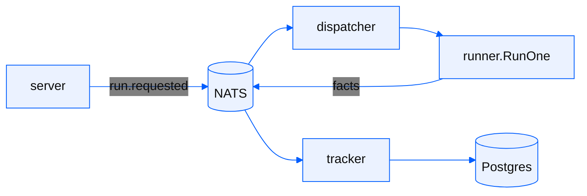

Filament is one execution path surrounded by small modules that decide when
and where it runs. The code splits along three lines:

- The domain model (sources, sinks, records, plans, runs) lives in the root `filament` package
- Execution lives in `runner` and `pipeline`
- Control-plane behaviors are `module.Module` implementations

Processes never call each other. Postgres (state) and NATS (facts) are the
only shared surfaces.

## The runner

Every run executes through `runner.RunOne`, and it behaves identically
wherever it is dispatched:

- In-process inside the control plane or standalone binary
- In your own process via the library
- In a worker Job on Kubernetes

Where a run executes is a deployment choice and never a behavioral one. The
full `RunOne` sequence is covered in
[Runs and recovery](/pages/guides/concepts/runs-and-recovery).

## The pipeline

Inside a run, records flow through fixed stages:

```
source → inlet → batcher shards → writer pool → sink
```

- The inlet routes each record to its resource's batcher shard by hash.
  Shard count equals writer count equals `SnapshotParallelism` (forced to 1
  whenever ordering matters, as with CDC, incremental, or checkpointed
  resources).
- Batchers buffer per `(resource, part)` and flush at `BatchMaxRows` (the
  sink's `PreferredBatchRows`, else 256) or on a 1s ticker.
- Writers call `Sink.Apply` and verify each batch's CRC (see
  [Integrity & checkpoints](/pages/guides/concepts/integrity-and-checkpoints)).

Backpressure is blocking. A source's `Push` blocks when channels are full, so
a slow sink throttles extraction instead of growing memory. A fatal pipeline
error unblocks the source with the error.

## Facts and derived state

The runner never writes run status. As a run progresses it publishes typed
facts on the bus, under the subject grammar:

```
ingestion.v1.<entity>.<tenant>.<run>.<event>
```

`run.started`, `batch.written`, `resource.completed`, `run.completed`, and
the rest. The full catalog is in
[Runs and recovery](/pages/guides/concepts/runs-and-recovery).

Run state is *derived*. The tracker module is the only writer of
fact-derived state. It consumes durably, dedupes on broker sequence, and
folds facts idempotently into Postgres. At-least-once delivery plus
idempotent folds gives exactly-once effect. The one exception is checkpoint
seeding, which the runner persists itself before extraction begins.



## Modules

Modules never reference each other. Each subscribes to facts and reads or
writes shared state.

| Module | Responsibility |
|---|---|
| orchestrator | Intake. Persists run state and publishes `run.requested` idempotently |
| scheduler | Fires cron schedules, promoting pre-created scheduled runs to requested |
| dispatcher | Places each requested run onto an execution backend |
| engine | In-process dispatch backend. Consumes `run.requested` and calls `runner.RunOne` |
| tracker | Folds facts into run state, tallies, and checkpoints |
| reaper | Fails runs whose heartbeats have gone stale (Kubernetes dispatch only) |

## Dispatch backends

There are two. The first is the in-process engine module
(`DISPATCH_MODE=inproc`, and what the standalone binary and library use).
The second is Kubernetes dispatch, which creates one Job per run — the
worker binary executes a single run and emits heartbeats. Both call
`runner.RunOne` on the same persisted run state. The `run.requested` fact
is only a trigger.

## Pluggability

Connectors, the data store, and the event bus are interfaces with swappable
implementations. Connectors self-register via blank imports. See
[Building a connector](/pages/connectors/building-a-connector/writing-a-source).
