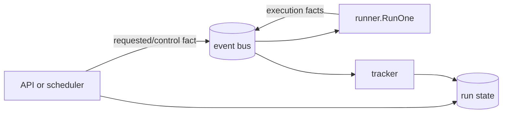

Filament has one execution path whether a run starts in-process, from the
standalone binary, or in a Kubernetes worker. Deployment changes where the work
runs, not how connectors exchange data.

## Follow one batch

Suppose a source is reading the `users` table. It opens a typed Arrow builder
for a specific `(resource, part)`, writes rows into it, and flushes when the
builder reaches a configured limit. The engine then moves the resulting batch
through a bounded channel to a writer, which calls the sink:

```text
source → typed row builder → bounded Arrow batch → writer pool → sink.Apply
```

A **part** is a unit of source work, such as a snapshot range or stream
partition. The source assigns each batch to a part so its progress can be
tracked independently.

The engine checks the in-memory batch before and after the sink call. A sink
that advertises encoded integrity also returns evidence for the exact bytes it
serialized. See [Integrity and checkpoints](/pages/guides/concepts/integrity-and-checkpoints)
for the boundary each checksum protects.

## Backpressure and parallelism

The handoff to writers is deliberately bounded. If `sink.Apply` cannot keep up,
the source eventually blocks while flushing a builder. That pressure propagates
to extraction and caps queued memory.

`snapshot_parallelism` sets the writer-pool size and is also available to the
source when it plans snapshot work. It does not automatically split or hash
rows. The source still decides how many parts to create. Filament forces the
writer count to one when a route contains CDC, incremental, or other
checkpointed work so progress and ordering stay unambiguous.

## Commit, abort, and checkpoints

The runner opens the sink before data moves and ends with one of two outcomes:

- On success, it calls `Commit`. CDC positions and other progress that depends
  on a successful commit are saved only after this call succeeds.
- On a non-resumable failure or cancellation, it calls `Abort` on a bounded
  cleanup context.

A resumable extraction failure preserves already durable progress instead of
aborting it. Whether a route qualifies depends on every resource in that route,
not merely on one incremental table. The recovery rules are described in
[Runs and recovery](/pages/guides/concepts/runs-and-recovery).

## Facts and stored state

The runner publishes events such as `run.started`, `batch.written`, and
`resource.completed`. The tracker uses those events to update stored progress,
totals, and checkpoints.

The control plane writes request, pause, resume, and cancellation state directly.
Worker events record what actually happened during execution. Keeping those
steps separate lets the API accept a control request while a worker is still
responding to it.



## Where the pieces live

The root `filament` package defines connector and run contracts. `runner`
coordinates one run, while `pipeline` owns the bounded Arrow handoff and writer
pool. Control-plane modules handle scheduling, dispatch, tracking, and stale
worker detection. Connectors register independently and implement only the
capabilities they advertise.
