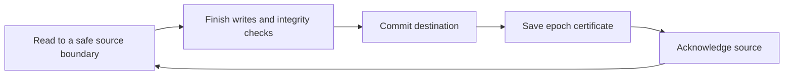

A continuous run keeps listening for new data and commits progress along the
way. Imagine an orders feed that receives messages throughout the day. There
is no final message to wait for, so Filament repeatedly finishes a small portion
of the feed, saves where it reached, and begins the next portion.

Each of those portions is an **epoch**. An epoch gives an ongoing stream a
recovery boundary without requiring the connection to close or the run to end.

## Continuous execution and CDC

Execution mode answers how long the work runs. A bounded run reads a finite
amount of data and finishes. A continuous run stays active until paused,
stopped, or interrupted. Bounded execution is the default.

CDC answers a different question: what the source reads. It reads database
changes, including inserts, updates, and deletes. A bounded CDC run can catch
up to a log position and finish. A continuous message source can stay open
without reading a database change log at all.

Continuous execution requires native streaming support from both connectors
and a datastore that supports the streaming runtime. Support for bounded CDC
or incremental reads alone does not qualify a connector. The
[Kafka](/pages/connectors/sources/kafka) and
[NATS](/pages/connectors/sources/nats) source pages describe their current
continuous behavior and limitations.

## Follow an order through an epoch

Suppose the last saved position in an orders feed is message 100. The next
epoch reads messages 101 through 150 and sends their rows to the destination.
Filament then needs to establish three things in order:

1. All rows through message 150 have finished passing through the pipeline,
   including the batch integrity checks.
2. The destination has confirmed the epoch's writes are durable according to
   its connector contract.
3. Filament has durably recorded the source position and the destination's
   receipts together in its datastore.

Only then may the source acknowledge that progress upstream. For a message
broker, that acknowledgement can tell it that these messages no longer need
to be delivered to this consumer.

The saved record is called an **epoch certificate**. It ties the source
positions, destination receipts, and completed pipeline work to a particular
stream and worker attempt. It is the durable evidence used for progress and
recovery; a successful batch write alone cannot advance continuous progress.

## Batches and epochs have different jobs

A batch controls how rows move through memory and into the sink. An epoch
controls how much work is committed and recorded together. One epoch may
contain several batches, and an epoch does not imply atomic visibility at
every destination.

For example, the PostgreSQL streaming sink uses a transaction for each epoch.
The NATS sink publishes messages that become visible individually. Finishing
the epoch confirms those publishes; it does not turn them into a transaction.

Epoch boundaries use soft targets for record count, bytes, idle wait, and age.
A source may need to finish a transaction before returning a safe boundary,
even if that exceeds a target. An idle read with no progress does not create
a certificate. A boundary that safely advances the source position can be
certified even when it produces no destination rows.

The current coordinator processes epochs serially. Rows still pass through
the bounded Arrow pipeline, so a slow destination eventually makes the source
wait. The source session must keep its connection and protocol alive during
that wait.

## Where a stream resumes

A stream may have more than one bookmark. Kafka partitions, for example, each
have their own position. Filament calls each independently ordered part of a
source an **ordering domain**. A position belongs to that domain and to a
particular incarnation of the source, so a recreated feed cannot silently
reuse progress from an older one.

These bookmarks describe source progress, not a universal ordering across all
rows. Reading partitions one at a time does not establish a meaningful global
order between them. Filament checks the source's advertised ordering against
the destination's write requirements before starting.

If the orders worker fails before its epoch certificate is saved, the durable
bookmark remains at 100. A later attempt may read messages 101 through 150
again. This can happen even if the destination committed them: the worker
might have stopped between the destination commit and the datastore write.

Recovery is therefore **at least once**. Append destinations can contain
duplicates after replay. A destination may use stable event identities to
deduplicate, but the strength and duration of that protection belong to the
connector. An epoch certificate does not provide universal exactly-once writes.

If the certificate was saved but the source acknowledgement failed, the saved
position remains valid. A replacement worker starts with that certified
progress; any upstream acknowledgement still requires current ownership.

## Pause, stop, and worker ownership

Continuous runs support pause, resume, and stop. A pause or stop first changes
the desired state. The worker observes that request and tries to finish the
current epoch within a bounded drain period. Until it finishes, the observed
state can be `draining`. Forced cancellation leaves unfinished work uncertified.

Resume enables a paused execution again. A stopped execution requires a new
start. These controls differ from the cancel behavior of
[bounded runs](/pages/guides/concepts/runs-and-recovery).

Each worker holds a renewable lease. Filament checks ownership when recording
progress and before acknowledging the source. A worker that loses ownership
must stop, even if it still has buffered messages.

Lease expiry alone cannot prove that an old worker has stopped affecting the
destination. If shutdown cannot be confirmed, the execution becomes `blocked`
and automatic replacement is refused. This prevents a new worker from writing
alongside an old worker whose requests may still be in flight. Cleanly ended
attempts can retry with backoff; repeated failures without progress eventually
pause the execution.

When inspecting a continuous run, look at its desired and observed execution
states, reason, and last committed time alongside the logical run status.
Committed totals come from saved epochs. A quiet feed can remain running
without producing a new commit, while a blocked worker can leave the logical
run active without making progress.

## Building streaming support

The [streaming connector guide](/pages/connectors/building-a-connector/streaming)
explains how sources establish safe boundaries and how sinks participate in
the epoch lifecycle. For the checks applied to every batch, see
[Integrity and checkpoints](/pages/guides/concepts/integrity-and-checkpoints).
